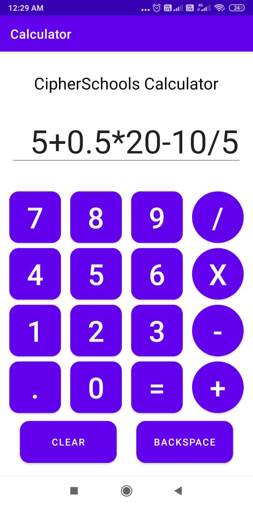
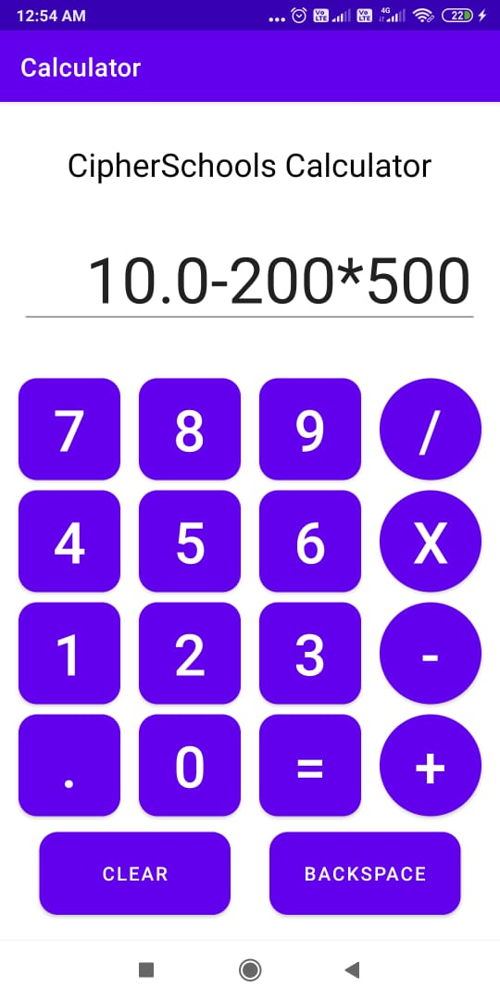
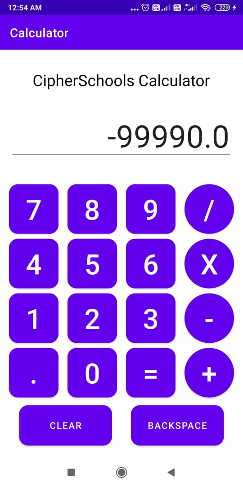

## Challenge

Create a functional mobile Calculator App. 

**Mandatory Features:**

- Language used should be Java.
- Calculations should be performed for numbers having 3-digits.
- The numeric buttons should be rectangular with a curved radius of 40 px and the operator keys should be circular.
- It should perform arithmetic calculations on Positive, Negative and decimal numbers. 

## Ouput

### Expression entered - 1:

### Value evaluated - 1:

------------------------------------------------------------------------------------------------------------------------------------

### Expression entered - 2:

### Value evaluated - 2:

